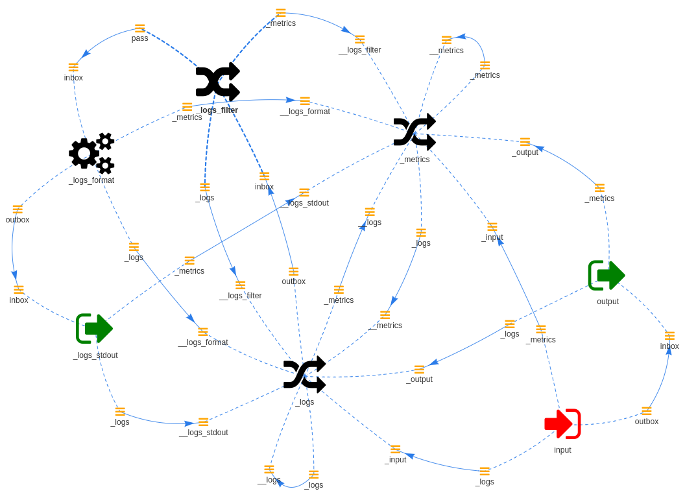

=============
Bootstrap CLI
=============

An important aspect of Wishbone is the ability to bootstrap a server on CLI.

To bootstrap you need the following items:

.. toctree::

    bootstrap_file
    wishbone_executable

Behind the scenes, the Wishbone bootstrap process automatically makes a couple
of configurations:

* All the ``_metrics`` queues of all modules are connected a
  ``wishbone.module.flow.funnel`` instance called ``_metrics`` from where the
  user can optionally connect modules for further metric processing.

* All the ``_logs`` queues of all modules are connected a
  ``wishbone.module.flow.funnel`` instance called ``_logs``. The ``_logs``
  module instance is then connected to a ``wishbone.module.flow.queueselect``
  instance called ``_logs_filter`` in order to filter out the logs according to
  the ``--log_level`` value.

* If the ``Wishbone`` server is started with ``--fork`` then ``_logs_filter.pass``
  is connected to a ``wishbone.module.output.syslog`` instance called
  ``_logs_syslog`` which has the effect all modules logs are written to
  syslog.

* If the ``Wishbone`` server is started without ``--fork`` then ``_logs_filter.pass``
  is connected to a ``wishbone.module.output.stdout`` instances called
  ``_logs_stdout`` which has the effect all modules logs are written to
  stdout.

The following bootstrap file:

.. code-block:: yaml
    :caption: hello_world.yaml

    modules:
      input:
        module: wishbone.module.input.generator
        arguments:
          payload: hello world

      output:
        module: wishbone.module.output.stdout

    routingtable:
      - input.outbox -> output.inbox

Generates following setup when run in foreground:

This includes the user defined ``input.outbox -> output.inbox`` connections
including the auto-generated `metrics` and `logs` modules.

