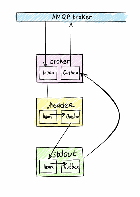

=======
Example
======= 

Let's make a simple program which consumes data from an AMQP messagebroker, prints it to STDOUT and writes the data back into the broker:

The Wishbone framework comes with modules such as the io_module "Broker" and the module "STDOUT".
The Broker module consumes and produces data to a message broker infrastructure, while the STDOUT module merely prints messages from its inbox and then puts those messages back into outbox.

.. code-block:: python
    :linenos:
    
    #!/usr/bin/python

    import wishbone
    from wishbone.toolkit import PrimitiveActor

    class Header(PrimitiveActor):
        def __init__(self, name, *args, **kwargs):
            PrimitiveActor.__init__(self, name)
        def consume(self,message):
            message['header']['broker_exchange'] = ''
            message['header']['broker_key'] = 'test'
            self.sendData(message)

    wb = wishbone.Wishbone()
    wb.registerModule ( ('wishbone.io_modules.broker', 'Broker', 'broker'), host='sandbox', vhost='/', username='guest', password='guest', consume_queue='indigo' )
    wb.registerModule ( ('wishbone.modules.stdout', 'STDOUT', 'stdout') )
    wb.registerModule ( ('__main__', 'Header', 'header') )

    wb.connect (wb.broker.inbox, wb.stdout.inbox)
    wb.connect (wb.stdout.outbox, wb.header.inbox)
    wb.connect (wb.header.outbox, wb.broker.inbox)

    wb.start()

-   lines 15,16,17 we register our modules in the Wishbone class.
-   lines 19,20 and 21 we connect the queues defining the actual dataflow.

The Header class is a Wishbone module created from scratch by inheriting the PrimitiveActor baseclass.
When this baseclass is inherited, the modules automatically gets an inbox and outbox queue.
For each message arriving in the inbox queue, the consume() function is called.  In this function we modify the header with extra information.
This allows the Broker module to route messages using a specific exchange and or routing key.

And that's it!

=============
More Examples
=============

The examples directory contains multiple examples.

-------------
udp_server.py
-------------
An UDP listener which writes incoming data to STDOUT.

-------------
speed_test.py
-------------
Consumes 1 messages from a queue called wb_speedtest and produces that message again to the same queue essentially making a loop.
This might give you an idea of IO when looking at the msg/s in your broker admin interface.
