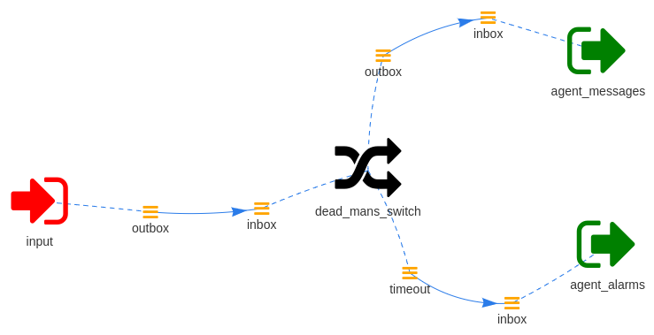

===================
A dead man's switch
===================

The following Wishbone bootstrap file triggers an action in the case an event
is expected but not received within a certain time window. This principle is
called `a dead man's switch`_.

For this setup we will make use of :py:class:`wishbone.module.flow.fresh <wishbone.module.fresh.Fresh>`.

.. NOTE::
   The ``wishbone_contrib.module.input.httpserver`` module is an external
   module and should be installed separately.

Consider following bootstrap file:

.. code-block:: yaml

    modules:
      input:
        module: wishbone_contrib.module.input.httpserver

      dead_mans_switch:
        module: wishbone.module.flow.fresh
        arguments:
          timeout: 10
          timeout_payload:
            message: We didn't recieve the expected keepalive signal from agent X.
          recovery_payload:
            message: Agent X says hello.

      agent_messages:
        module: wishbone.module.output.stdout
        arguments:
          prefix: 'Agent message :'
          colorize: true
          foreground_color: GREEN
          payload: '{{data}}'

      agent_alarms:
        module: wishbone.module.output.stdout
        arguments:
          prefix: 'Agent status :'
          colorize: true
          foreground_color: RED
          payload: '{{data}}'

    routingtable:
      - input.outbox             -> dead_mans_switch.inbox
      - dead_mans_switch.outbox  -> agent_messages.inbox
      - dead_mans_switch.timeout -> agent_alarms.inbox

The diagram of this bootstrap file:

The output looks like:

.. code-block:: text

    $ wishbone start --config simple.yaml

    Instance started in foreground with pid 11971
    2017-11-19T15:58:10.4449+00:00 wishbone[11971] informational input: Serving on 0.0.0.0:19283 with a connection poolsize of 1000.
    Agent message :hello
    2017-11-19T15:58:16.3481+00:00 None[11971] informational input: 127.0.0.1 - - [2017-11-19 16:58:16] "PUT / HTTP/1.1" 200 103 0.000461
    Agent message :hello
    2017-11-19T15:58:19.3404+00:00 None[11971] informational input: 127.0.0.1 - - [2017-11-19 16:58:19] "PUT / HTTP/1.1" 200 103 0.000323
    Agent status :We didn't recieve the expected keepalive signal from agent X.
    2017-11-19T15:58:29.4267+00:00 wishbone[11971] informational dead_mans_switch: Timeout of 10 seconds expired.  Generated timeout event.

Whenever data is submitted into Wishbone's webserver ``echo hello|curl -XPUT
-d @- http://localhost:19283/`` the timeout window resets and the message gets
submitted to the ``agent_messages`` module instance.

When data is not submitted withint the predefined window of 10s then an
internal event is generated and send to the ``agent_alarms`` output module.

.. _a dead man's switch: https://en.wikipedia.org/wiki/Dead_man%27s_switch
