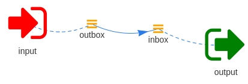

===========
Hello World
===========

The obligatory `hello world` example:

.. code-block:: yaml
    :caption: hello_world.yaml

    modules:
      input:
        module: wishbone.module.input.generator
        arguments:
          payload: hello world

      output:
        module: wishbone.module.output.stdout

    routingtable:
      - input.outbox -> output.inbox

The setup diagram:

Executing the server:

.. code-block:: text

    $ wishbone start --config hello_world.yaml
    Instance started in foreground with pid 21669
    {'cloned': False, 'bulk': False, 'data': 'hello world', 'errors': {}, 'tags': [], 'timestamp': 1510156238.5204272, 'tmp': {}, 'ttl': 253, 'uuid_previous': [], 'uuid': '69f85535-2502-4eee-b58c-55f21293057f'}
    {'cloned': False, 'bulk': False, 'data': 'hello world', 'errors': {}, 'tags': [], 'timestamp': 1510156239.5209413, 'tmp': {}, 'ttl': 253, 'uuid_previous': [], 'uuid': '5049c94c-bc57-4581-a972-85a330f190f6'}
    {'cloned': False, 'bulk': False, 'data': 'hello world', 'errors': {}, 'tags': [], 'timestamp': 1510156240.522063, 'tmp': {}, 'ttl': 253, 'uuid_previous': [], 'uuid': 'e17a8fff-a99b-481c-91c6-3be62c0b015f'}
    {'cloned': False, 'bulk': False, 'data': 'hello world', 'errors': {}, 'tags': [], 'timestamp': 1510156241.5230553, 'tmp': {}, 'ttl': 253, 'uuid_previous': [], 'uuid': '317835eb-7cc5-4cbb-8778-eca8bdf7e280'}
    {'cloned': False, 'bulk': False, 'data': 'hello world', 'errors': {}, 'tags': [], 'timestamp': 1510156242.5241177, 'tmp': {}, 'ttl': 253, 'uuid_previous': [], 'uuid': '9b73cdb1-54fb-434c-9114-d698afb936db'}
    {'cloned': False, 'bulk': False, 'data': 'hello world', 'errors': {}, 'tags': [], 'timestamp': 1510156243.5250602, 'tmp': {}, 'ttl': 253, 'uuid_previous': [], 'uuid': '7b2a65fa-30aa-4fab-9c7c-058f1ddcd92c'}
    {'cloned': False, 'bulk': False, 'data': 'hello world', 'errors': {}, 'tags': [], 'timestamp': 1510156244.5259635, 'tmp': {}, 'ttl': 253, 'uuid_previous': [], 'uuid': 'eb1f5177-33ac-4daa-b41d-f0a82b2b2375'}
    {'cloned': False, 'bulk': False, 'data': 'hello world', 'errors': {}, 'tags': [], 'timestamp': 1510156245.5269322, 'tmp': {}, 'ttl': 253, 'uuid_previous': [], 'uuid': '91c4e3e4-b8ce-40b8-81a7-d34581b8bd79'}
    {'cloned': False, 'bulk': False, 'data': 'hello world', 'errors': {}, 'tags': [], 'timestamp': 1510156246.527863, 'tmp': {}, 'ttl': 253, 'uuid_previous': [], 'uuid': 'ba920b77-7477-424b-b4e6-a7075764d55f'}
    {'cloned': False, 'bulk': False, 'data': 'hello world', 'errors': {}, 'tags': [], 'timestamp': 1510156247.5287836, 'tmp': {}, 'ttl': 253, 'uuid_previous': [], 'uuid': '75f0df63-fdec-415d-abcc-b2f1dbaa4b6f'}
    ^C2017-11-08T15:50:48.4685+00:00 wishbone[21669] informational input: Received stop. Initiating shutdown.
    2017-11-08T15:50:48.4688+00:00 wishbone[21669] informational output: Received stop. Initiating shutdown.
    $
