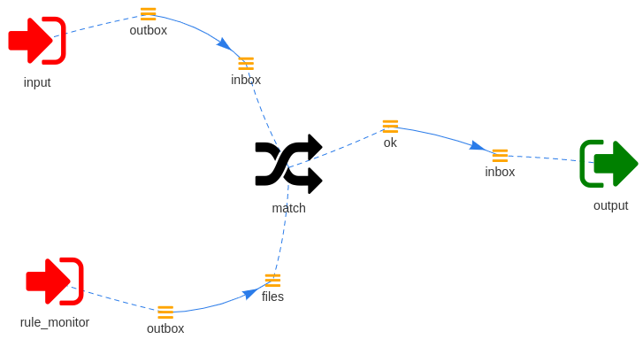

=======================
Read data using inotify
=======================

Some modules need read data from disk.  Wishbone comes with the
:py:class:`wishbone.module.input.inotify
<wishbone.module.wb_inotify.WBInotify>` which can be setup to listen for
filesystem changes required to reload your data from disk.

The :py:class:`wishbone.module.queueselect.QueueSelect` is a module which can
read its conditions from disk. Obviously when these rules change they have to
be reloaded. Instead of having to build the file monitoring/reload
functionality its easier to foresee a queue which can process the events
indicating files have changed.

The following yaml bootstrap file demonstrates how
:py:class:`wishbone.module.input.inotify
<wishbone.module.wb_inotify.WBInotify>` can be used to feed a module changes
to files so it can respond to that accordingly:

.. NOTE::
   Obviously the module receiving the inotify events needs to have specific support for that.

.. code-block:: yaml

    modules:
      input:
        module: wishbone.module.input.generator
        arguments:
            payload: ok

      rule_monitor:
        module: wishbone.module.input.inotify
        arguments:
          paths:
            "/var/tmp/rules": [
                "IN_CREATE",
                "IN_CLOSE_WRITE",
                "IN_DELETE"
            ]
          glob_pattern: "*.yaml"

      match:
        module: wishbone.module.flow.queueselect
        arguments:
          templates:
            - name: test
              queue: >
                {{ 'ok' if data == 'ok' }}

      output:
        module: wishbone.module.output.stdout

    routingtable:
      - input.outbox        -> match.inbox
      - match.ok            -> output.inbox

      - rule_monitor.outbox -> match.files

The bootstrap file translates into following diagram:

