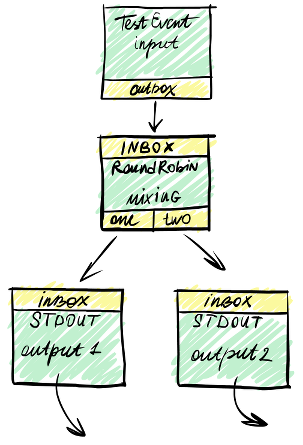

========
Wishbone
========

**A Python framework to build event pipeline servers with minimal effort.**

https://github.com/smetj/wishbone

Bootstrap a  server
===================

Wishbone servers are started with bootstrap file:

.. code-block:: sh

    $ wishbone start --config eventprocessor.yaml

Bootstrap file define the modules_ to initialize and how these should be
connected to each other:

.. literalinclude:: examples/test_setup.yaml
   :language: yaml

Executing a bootstrap file:

.. code-block:: sh

    [smetj@dev-container ~]$ wishbone debug --config simple.yaml --id docker
    2014-08-06T23:17:41 wishbone[6609]: debug metrics_funnel: Started with max queue size of 100 events and metrics interval of 1 seconds.
    2014-08-06T23:17:41 wishbone[6609]: debug metrics_funnel: preHook() found, executing
    2014-08-06T23:17:41 wishbone[6609]: debug logs_funnel: Started with max queue size of 100 events and metrics interval of 1 seconds.
    2014-08-06T23:17:41 wishbone[6609]: debug logs_funnel: preHook() found, executing
    2014-08-06T23:17:41 wishbone[6609]: debug mixing: Started with max queue size of 100 events and metrics interval of 1 seconds.
    2014-08-06T23:17:41 wishbone[6609]: debug mixing: preHook() found, executing
    2014-08-06T23:17:41 wishbone[6609]: debug input: Started with max queue size of 100 events and metrics interval of 1 seconds.
    2014-08-06T23:17:41 wishbone[6609]: debug input: preHook() found, executing
    2014-08-06T23:17:41 wishbone[6609]: debug output1: Started with max queue size of 100 events and metrics interval of 1 seconds.
    2014-08-06T23:17:41 wishbone[6609]: debug output2: Started with max queue size of 100 events and metrics interval of 1 seconds.
    2014-08-06T23:17:41 wishbone[6609]: debug log_stdout: Started with max queue size of 100 events and metrics interval of 1 seconds.
    2014-08-06T23:17:41 wishbone[6609]: debug log_format: Started with max queue size of 100 events and metrics interval of 1 seconds.
    2014-08-06T23:17:41 wishbone[6609]: debug syslog: Started with max queue size of 100 events and metrics interval of 1 seconds.
    2014-08-06T23:17:41 wishbone[6609]: debug syslog: preHook() found, executing
    I am number one: test
    I am number two: test
    I am number one: test
    I am number two: test
    I am number one: test
    I am number two: test
    I am number one: test
    ^C2014-08-06T23:18:09 wishbone[6609]: debug syslog: postHook() found, executing
    2014-08-06T23:18:09 wishbone[6609]: debug syslog: postHook() found, executing
    2014-08-06T23:18:09 wishbone[6609]: informational input: Stopped producing events.
    [smetj@dev-container ~]$

Contents:

.. toctree::
    :maxdepth: 2

    introduction
    installation
    bootstrap files
    cli options
    lookup functions
    writing a module
    wishbone module
    router
    builtin modules

Indices and tables
==================

* :ref:`genindex`
* :ref:`search`

.. _modules: builtin%20modules.html