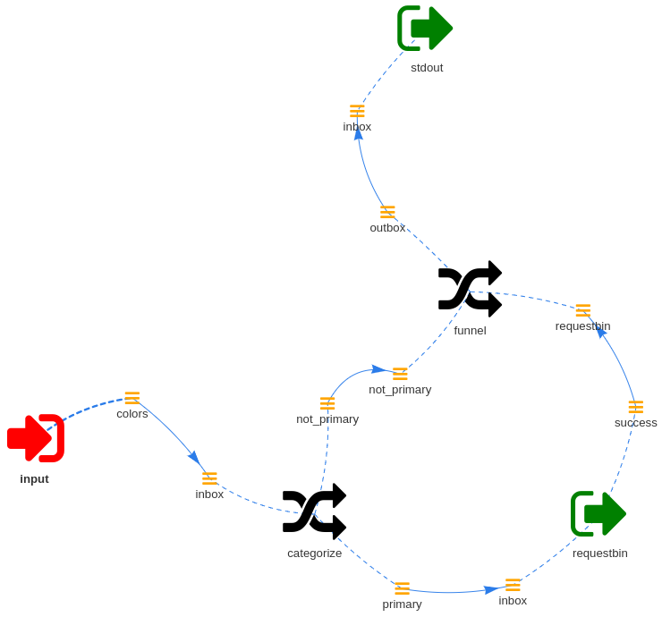

Topology
--------

Sometimes it's useful to have a graphical representation of the bootstrap file
showing the toplogy of the connected modules and queues.

For this you can start wishbone using the ``--graph`` switch.

::

    $ wishbone start --config test.yaml --graph

This will start a webserver which listens on port 8088.  Visiting the url with
your browser produces a graph showing all the loaded modules including the
connected queues.

