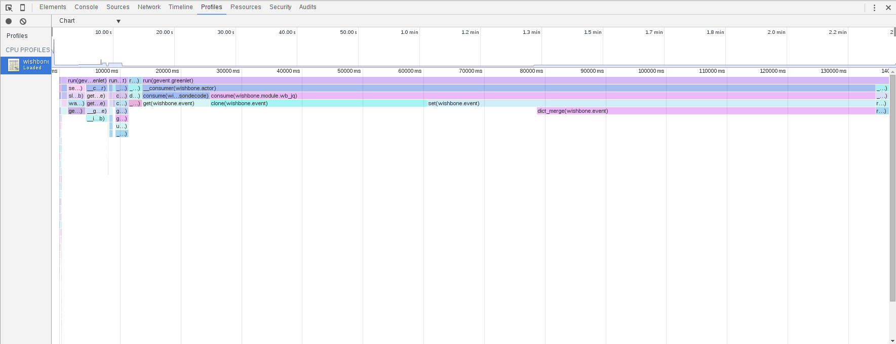

=============
Miscellaneous
=============

Profiling
---------

If want to profile Wishbone to locate a performance issue you can
start the Wishbone server in debug mode using the *--profile* option.

::

    $ wishbone debug --config test.yaml --profile

This starts the Wishbone in profile modus staying in foreground collecting
statistics which can be loaded and viewed afterwards in Chrome's "Developer
Tools".

Pressing CTRL+C will stop the server and dump a file named
*wishbone_<pid>_.cpuprofile*.

Graph topology
--------------

If you have a complex bootstrap file it can be difficult to get a good insight
into the data flow.  To get a graphical representation of the loaded bootstrap
file you can start wishbone using the *--graph* switch.

::

    $ wishbone debug --config test.yaml --graph

This will start a webserver which listens on port 8088.  Visiting the url with
your browser produces a graph showing all the loaded modules including the
connected queues.

.. image:: graph.png
    :width: 25%

Caveats
-------

Wishbone comes with a couple of caveats you need to keep in mind:

- **Storing data in** :py:class:`wishbone.event.Event`:

  You can store whatever Python object type in
  :py:class:`wishbone.event.Event` but when using
  :py:func:`wishbone.Event.clone` keep in mind that only a naive copy is done
  which works fine for default types but probably not for more complex
  objects.  It does not behave as a deepcopy().Preferably you should only store
  JSON style data in Events.

- **Queues which are not connected**:

  When a queue is not connected to another queue then submitting a message
  into it will result into the message being dropped.This is by design to
  ensure queues do not fill up without ever being consumed.

- **IO-bound VS CPU-bound workload**:

  Since Wishbone heavily leans on the Gevent library it lends itself best for
  IO bound workloads.If you have a CPU intensive task, a good idea might be to
  decouple the IO part from the CPU-intensive part of the chain by running
  multiple Wishbone processes and pass messages from one to the other.

