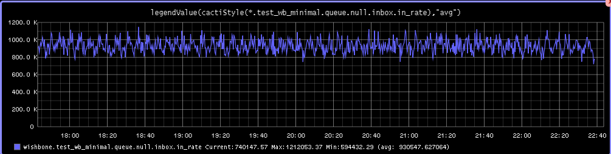

================
Logs and metrics
================

Logs
----

.. autoclass:: wishbone.event.Metric

::

    Log({'message': 'Received stop. Initiating shutdown.', 'module': 'metrics_graphite', 'pid': 18179, 'level': 6, 'time': 1454272074.556823}

Each module inherits an instance of :py:class:`wishbone.Logging`.

When modules are loaded and initialized, :py:class:`wishbone.router.Default`
will automatically connect the *logs* queue of all modules to a
:py:class:`wishbone.module.Funnel` instance called **@logs**. This module
centralizes the logs of all modules.

If the user decides not to connect queue *@logs.outbox* to another queue then
Wishbone will automatically initialize additional modules to it logs to either
SYSLOG or STDOUT depending on it's started to run in the background (--start)
or foreground (--debug) respectively.

If you would like to send the centralized logs to another location you can
achieve this by connecting queue *@logs.outbox* to other modules.

Metrics
-------

.. autoclass:: wishbone.event.Metric

::

    Metric({'tags': (), 'unit': '', 'value': 0, 'name': 'module.input.queue.failed.size', 'source': 'server01', 'type': 'wishbone', 'time': 1454271176.479039})

Each Wishbone module collects metrics of its queues.  Metrics are generated at
the defined interval (see cli option --frequency).

When modules are loaded and initialized, :py:class:`wishbone.router.Default`
will automatically connect the *metrics* queue of all modules to a
:py:class:`wishbone.module.funnel.Funnel` instance called **@metrics**. This module
centralizes the metrics of all modules.

By default the **@metrics.outbox** queue is not connected to another module
(in contrary to **@logs.outbox**) therefor all metric data is lost by default.
If however you would like to process the Wishbone metrics externally you can
hook up the necessary modules to **@metrics.outbox** to achieve the desired
result.

For example you can forward the Wishbone metrics to Graphite by chaining
:py:class:`wishbone.module.graphite.Graphite` (converts
:py:class:`wishbone.event.Metric` into a Graphite format) and
:py:class:`wishbone.module.tcpout.TCPOut` (submits the Graphite data over TCP to
Graphite).

